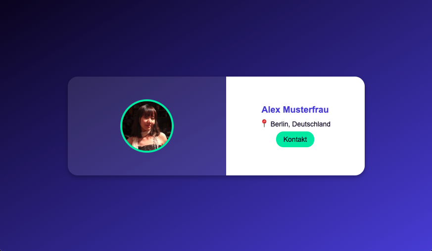

# **Projekt: User Card Evolution**

Ein Web-Projekt zur Gestaltung einer **User Card**, die schrittweise optisch verbessert wird.

---

Farben für dieses Projekt:

- white: #ffffff
- primary: #5d3ede
- secondary: #ded4eb
- accent: #00ecaa
- background: #070021
- highlight: #ffda1a
- text-primary: #070021
- text-secondary: #5d3ede

## **Feature-Liste & Implementierungsplan**

### **Ticket 1: HTML-Grundstruktur mit allen Inhalten erstellen**

**Ziel:** Alle benötigten Informationen in die HTML-Datei aufnehmen.

**Anforderungen:**

- Eine `div`-Box mit der Klasse `.card`, die die gesamte User Card umschließt.
- Zwei Unterbereiche:
  - `.card-left` für das Profilbild.
  - `.card-right` für Name, Standort und Kontakt.
- Ein Profilbild wird angezeigt. (https://randomuser.me/api/portraits/women/70.jpg)
- Eine Überschrift für den Namen.
- Ein Absatz für den Standort.
- Ein Link für die Kontaktaufnahme per E-Mail.

> Die Box hat noch **kein Styling** und erscheint in der Standard-Browser-Darstellung.

---

## **Ticket 2: Grundlegendes CSS für die User Card hinzufügen**

**Ziel:** Die Karte sichtbar machen und die Struktur mit `display: flex` aufbauen.

### **Anforderungen:**

- `.card` bekommt eine feste **Breite (400px) und Höhe (200px)**.
- Eine **sichtbare Umrandung** wird hinzugefügt.
- Die Elemente `.card-left` und `.card-right` werden **nebeneinander** angeordnet.
- Eine Standard-Schriftart wird gesetzt.

---

## **Ticket 3: Profilbild und rechte Seite richtig positionieren**

**Ziel:** Das Profilbild korrekt anzeigen und die rechte Seite (`.card-right`) ausrichten.

### **Anforderungen:**

- `.card-left` nimmt **50 % der Breite** ein.
- `.card-left` wird mit `display: flex` ausgestattet.
- Das Profilbild (`img`) bekommt eine feste Größe von **100px x 100px**.
- Das Bild wird **zentriert ausgerichtet**.
- `.card-right` nimmt ebenfalls **50 % der Breite** ein.
- `.card-right` wird mit `display: flex`, `flex-direction: column` und `align-items: center` ausgerichtet.

---

## **Ticket 4: Erste Farbgestaltung**

**Ziel:** Die Karte soll erste Farben erhalten.

### **Anforderungen:**

- Eine transparente Hintergrundfarbe für `.card` setzen.
- Die Schriftfarbe für `.card-right` anpassen.
- Eine Kontrastfarbe für den Kontakt-Link setzen.
- `.card-right` soll eine eigene Hintergrundfarbe erhalten.

---

## **Ticket 5: Abrundungen und Schatten hinzufügen**

**Ziel:** Die Box wirkt weicher und plastischer.

### **Anforderungen:**

- `.card` soll abgerundete Ecken erhalten.
- Ein Schatten soll hinzugefügt werden.
- `.card` soll überlaufende Inhalte verbergen.

---

## **Ticket 6: Profilbild abrunden & umrahmen**

**Ziel:** Das Bild soll sich besser ins Design einfügen.

### **Anforderungen:**

- Das Bild soll rund erscheinen.
- Einen Rahmen um das Bild setzen.
- Sicherstellen, dass das Bild nicht verzerrt wird.

---

## **Ticket 7: Typografie & Layout verfeinern**

**Ziel:** Die Lesbarkeit und das Layout optimieren.

### **Anforderungen:**

- `h2`, `p` und `a` bekommen verbesserte Schriftgrößen.
- Textfarben werden besser auf den Hintergrund abgestimmt.
- Abstände (`margin`, `padding`) für eine bessere Ausrichtung anpassen.
- `.card-right` soll einen Innenabstand erhalten.

---

## **Ticket 8: Semantische HTML-Tags einführen**

**Ziel:** Die Struktur der HTML-Datei verbessern.

### **Anforderungen:**

- `div`-Elemente durch semantische HTML5-Elemente ersetzen.
- Name bleibt als `h2`, Standort als `p` und Kontakt als `a`.

> **Hinweis:** Dieses Ticket hat **keinen Einfluss auf das Styling**.

---

## **Ticket 9: Einführung von Farbvariablen**

**Ziel:** Das Styling flexibler und anpassbarer machen.

### **Anforderungen:**

- Eine zentrale Farbpalette definieren.
- Alle bisherigen festen Farben durch CSS-Variablen ersetzen.

---

## **Ticket 10: Hintergrund der Seite verbessern**

**Ziel:** Der gesamte Hintergrund der Seite soll sich dem Design der Karte anpassen.

### **Anforderungen:**

- Ein Farbverlauf für den Hintergrund der Seite setzen.
- Der `body` soll die `.card` mittig im Viewport ausrichten.
- Der `body` soll die gesamte Höhe des Viewports einnehmen.

---

## **Ticket 11: Kontakt-Link verbessern**

**Ziel:** Der Kontakt-Link soll sich optisch besser einfügen.

### **Anforderungen:**

- Der Link soll eine Hintergrundfarbe erhalten.
- Der Link soll durch Innenabstände (Padding) größer und klickbarer werden.
- Die Ecken des Links abrunden.
- Der Link soll eine sanfte Farbänderung erhalten, wenn man mit der Maus darüberfährt.
